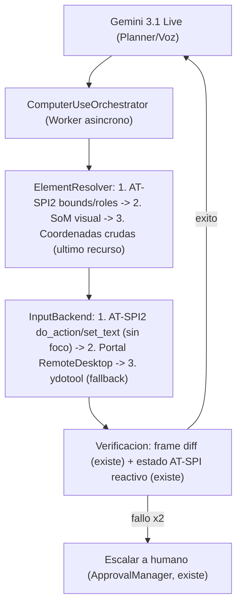

# 🖥️ Plan Atlas Computer-Use v2 — Investigado, Corregido y Verificado

> **Fecha**: Septiembre 2026
> **Origen**: Síntesis propia tras (1) investigar el funcionamiento real del "computer use" de OpenAI Codex Desktop, (2) auditar el código actual de Atlas línea por línea, y (3) corregir un plan previo generado por otro agente que contenía datos inventados y un error arquitectónico grave.
> **Regla de este documento**: Toda referencia a código incluye `archivo:línea` verificada. Toda afirmación externa lleva marca de confianza.

---

## 1. Investigación: cómo funciona REALMENTE el Computer Use de Codex Desktop

OpenAI opera dos mecanismos documentados:

| Mecanismo | Descripción | Debilidad documentada |
|---|---|---|
| **Code Execution Harness** | El modelo escribe scripts PyAutoGUI/Playwright, los ejecuta en sandbox y verifica con `pyautogui.screenshot()` | Latencia del bucle script → ejecutar → capturar → razonar |
| **`computer` tool (acciones estructuradas)** | El modelo emite `click(x,y)`, `keypress`, `scroll` con coordenadas absolutas | Fragilidad ante DPI, escalado y cambios de UI; alto costo en tokens de imagen (`detail: "original"`) |

- App de escritorio solo **macOS/Windows**; en Linux solo existe el CLI. [Confirmado]
- El update **"Codex for (almost) everything"** (16 abril 2026) introdujo computer use, worktrees, plugins+MCP, navegador embebido, automatizaciones programadas y multi-agente paralelo. [Confirmado]
- La versión "v26.415" que citaba el plan original **no existe** (inventada). 
- El navegador "Atlas" de OpenAI fue **descontinuado** por OpenAI en 2026; no usarlo como referente.
- Los nombres de modelos 2026 que circulan en agregadores ("gpt-6-astra", etc.) son **no verificables** contra fuentes primarias; se tratan como ruido.

### Lección estratégica de los benchmarks

- **OSWorld-Verified**: los mejores agentes del mundo rondan ~85-90%; **OSWorld 2.0** (tareas largas, ~318 llamadas a herramientas): el líder está en ~72%. [Agregadores: Steel.dev / BenchLM, sept 2026 — verificar antes de citar públicamente]
- Consenso de la industria en 2026: **"Agent = Model + Harness"**. El cuello de botella ya no es el modelo sino la ingeniería alrededor: resolución de elementos, verificación post-acción, recuperación ante fallos.
- **UI-TARS** (ByteDance, open-weights): ~94% ScreenSpot-V2 en grounding visual. Existe como red de seguridad local si se quisiera grounding sin enviar screenshots a la nube. [GitHub bytedance/UI-TARS]

**Conclusión**: Codex Desktop no tiene nada equivalente al `AccessibilitySensor` de Atlas. Su punto débil (coordenadas visuales) es exactamente el punto fuerte que Atlas ya posee con AT-SPI2.

---

## 2. Auditoría del código actual: Atlas ya está más avanzado de lo que el plan original creía

Verificado línea por línea en esta sesión:

| Capacidad existente | Ubicación | Relevancia |
|---|---|---|
| **Acción semántica sin robar foco ni puntero** (`click_element_action` vía `Atspi.Action.do_action`) | `src/utils/a11y.py:879` | Más determinista que cualquier click por coordenadas de OpenAI/Anthropic |
| **Inyección de texto directa** en campos (`set_element_text` vía `Atspi.EditableText`) | `src/utils/a11y.py` ~línea 845 | Elimina errores de keymap/Unicode |
| **Bounds absolutos de elementos** (`get_element_bounds`, `Atspi.CoordType.SCREEN`) | `src/utils/a11y.py:920` | Mitad del motor Set-of-Marks ya construida |
| **Descubrimiento de nodos interactivos** con roles/acciones/estados | `src/utils/a11y.py:936` (`find_interactive_nodes`) | Ídem |
| **Máquinas de estado reactivas** (WhatsApp: spinners/QR/READY; Telegram) | `src/utils/a11y.py` + `DEVELOPMENT_NOTES.md` §10, §15 | Atlas ya resolvió el problema #1 de los agentes GUI: sleeps ciegos |
| **Idempotencia de frames + normalización de coordenadas** (frame diff, `normalize_coordinates`) | `src/vision/service.py:97`, `:284` | Infraestructura del bucle OODA a medio construir |
| **Planner/Worker ya implementado**: Gemini Live (voz <250ms) delega a `DeveloperAgent` async con reasoning | `src/agents/developer_agent.py:83` | Es exactamente el patrón que la literatura 2026 recomienda para voz + herramientas lentas |
| **HITL multi-canal maduro** (voz / Web HUD / terminal) | `src/security/approval.py:25` | OpenAI sigue batallando con esto; Atlas ya lo tiene |
| **Path jail + allowlist de comandos read-only + rewrite a venv** | `src/agents/tools.py:26-94` | Base del modelo de tiers de riesgo |
| **Truco ScreenReaderEnabled** para forzar árbol AT-SPI en Chromium/Brave en runtime | `DEVELOPMENT_NOTES.md` §12 | Resuelve la mayor brecha de cobertura AT-SPI (apps web) |

### Corrección a nuestra propia documentación

`DEVELOPMENT_NOTES.md` afirma que la captura portal toma "0.01s". El código real (`src/vision/service.py:153-183`) incluye `sleep(0.3)` + polling de archivo con reintentos: la latencia real es **~0.5-0.9s por captura**. Es el cuello de botella #1 para un bucle OODA fluido → atacado en Fase 2.

---

## 3. Hallazgos de investigación que el plan original desconocía

### 3.1 El portal RemoteDesktop: segundo canal de input nativo
`org.freedesktop.portal.RemoteDesktop` soporta **inyección de teclado y puntero en GNOME 45+** sin daemon y sin permisos sobre `/dev/uinput` (implementaciones open-source funcionando: `voicsh`, `wdotool-core`). [Terceros, verificado en repos]
- Ventaja sobre ydotool: autorizado por el compositor (modelo de seguridad Wayland correcto) y no depende de `ydotoold.service` (que hoy está caído/disabled en esta máquina).
- Limitación: no permite keymap propio → texto Unicode arbitrario vía `wl-copy` + `Ctrl+V` (que ya es el patrón estándar de Atlas). Encaja sin fricción.

### 3.2 Error arquitectónico grave del plan original (Fase "headless")
El plan original proponía lanzar apps en un display virtual y "simular clics" ahí. **Imposible tal cual**: `ydotool` inyecta vía `/dev/uinput` a nivel kernel → los eventos llegan a la **sesión física activa**, no a un compositor headless. Una sesión headless correcta requiere:
- `sway --headless`/`cage` con `WLR_BACKENDS=headless`
- Inyección vía protocolos `zwlr_virtual_pointer_v1` / `virtual_keyboard_v1` (wtype/wlrctl)
- Bus D-Bus y registry AT-SPI **propios de esa sesión**

Además hay una contradicción estratégica: las PWAs con sesiones logueadas (WhatsApp, Gmail) **viven en la sesión real del usuario**; una sesión headless no las ve. El headless sirve solo para trabajo paralelo desechable (scraping, builds), no como modo por defecto. Se degrada a Fase 5 opcional.

### 3.3 Patrones de seguridad del estado del arte (aplicables gratis)
- **CaMeL (Google DeepMind)**: LLM privilegiado (planifica, llama herramientas) + LLM en cuarentena (lee pantalla/web, NO puede llamar herramientas). El contenido de screenshots/DOM debe tratarse como hostil.
- **Spotlighting (Microsoft)**: envolver todo texto extraído de pantalla con delimitadores de "contenido no confiable" antes de meterlo al contexto del planificador.
- **Tiers de riesgo** (estándar Claude Code / OpenHands): Tier-1 lectura → auto; Tier-2 escritura local → aprobación suave; Tier-3 irreversible (borrar, `git push`, enviar mensaje) → HITL obligatorio. `ApprovalManager` ya lo soporta; falta la política escrita.
- **Monitor model (OpenAI Lockdown)**: clasificador barato vigilando la secuencia de acciones; pausa automática ante comportamiento anómalo.
- **Credential broker**: el LLM nunca ve secretos; las herramientas los leen del entorno fuera del contexto del modelo (Atlas ya hace esto parcialmente: redacción de secretos + `_rewrite_to_venv`).

### 3.4 Latencias de referencia (para diseñar expectativas realistas)
- Paso típico de computer-use en la industria: **2-5s** (screenshot → LLM → acción).
- Voz dúplex Gemini Live: **<500ms**; con Planner/Worker el usuario nunca percibe bloqueo (Atlas narra "voy en ello" mientras el worker opera).
- Implicación: el bucle OODA debe resolver el **~80% de pasos sin LLM** (AT-SPI2 puro + espera reactiva), reservando el modelo para planificación y desambiguación.

---

## 4. Arquitectura objetivo

---

## 5. Fases del plan definitivo

### 🟥 Fase 0 — Fundaciones (2-3 días)
1. **Health-check auto-recuperable de input** al arrancar Atlas: verificar `ydotoold` activo; si no, intentar portal RemoteDesktop; log claro del backend elegido. (Hoy: `ydotoold.service` inactivo/disabled.)
2. **Política de riesgo por escrito** (`config/security_policy.yaml`): clasificar cada herramienta/acción en Tier 1/2/3.
3. **Mini-benchmark falsificable** (`tests/computer_use/`): 12-20 tareas reales del día a día ("abre Telegram y envía X a Y", "qué app tiene el foco", "crea doc en OnlyOffice"). Métrica: % éxito y segundos/tarea.
   > Sin esto, "superar a Codex" es marketing, no ingeniería.

### 🟧 Fase 1 — Capa de acción unificada (la ventaja competitiva real)
- `InputBackend` con 3 backends ordenados: **AT-SPI2 semántico** (sin robar foco) → **Portal RemoteDesktop** → **ydotool** (fallback). Todo texto vía `wl-copy`+Ctrl+V donde haya campo editable.
- `ElementResolver` en cascada: bounds AT-SPI2 → **SoM** (renderizar etiquetas `[1][2][3]` sobre el screenshot usando `find_interactive_nodes()` + `get_element_bounds()`, ambos ya implementados) → coordenada cruda del LLM solo como último recurso.
- Nueva herramienta para Gemini Live: `interactuar_gui(accion, objetivo)` que resuelve y ejecuta internamente, narrando por voz.
- **Claim corregido**: no "100% de precisión" (falso), sino: *determinista donde AT-SPI2 alcanza* (GTK/Chromium/Qt con a11y activa — cubre las PWAs críticas gracias al truco ScreenReaderEnabled) *con fallback visual medible*.

### 🟨 Fase 2 — Bucle OODA cuasi-gratis
- Orquestador async: **Observe** (frame diff + árbol AT-SPI, ambos existen) → **Decide** (LLM solo ante ambigüedad) → **Act** (Fase 1) → **Verify** (espera reactiva, existe).
- Reglas duras: máximo N pasos sin progreso → abortar y narrar; cancelación por barge-in de voz ("para", "detente"); todo texto leído de pantalla entra al contexto **con spotlighting** (anti prompt-injection).
- Optimización de captura: eliminar `sleep(0.3)` + polling (cachear/acelerar lectura portal, o `grim` cuando exista). Objetivo: **<200ms/captura**.

### 🟩 Fase 3 — Git Worktrees para DeveloperAgent (sin cambios; mejor ROI del plan original)
- `git worktree add .worktrees/agent-<task_id> -b agent/<task_id>` por tarea.
- pytest aislado en el worktree; diff mostrado en el HITL existente (payload de `escribir_archivo` ya muestra contenido; extender a diff unificado en el HUD).
- Merge a `main` **solo si pytest pasa 100%** → `recargar_plugins_atlas`.

### 🟦 Fase 4 — Navegador: CDP sobre el Chrome/Brave REAL del usuario (mejora sobre el plan original)
- En vez de Playwright headless aislado: **adjuntarse vía Chrome DevTools Protocol** al Brave/Chromium del usuario (`--remote-debugging-port=9222`), donde ya viven las sesiones (Gmail, WhatsApp). DOM real + cookies reales + screenshots fieles.
- Headless puro solo como sandbox desechable.

### 🟪 Fase 5 — Sesión headless (replanteado; opcional y desechable)
- Solo para trabajo paralelo sin valor de sesión (scraping complejo, builds).
- Receta correcta: `sway --headless`/`cage` + `WLR_BACKENDS=headless` + virtual pointer/keyboard wlr + bus AT-SPI dedicado. **Jamás ydotool ahí dentro.**
- Esfuerzo real estimado: 1-2 semanas (no "levantar Xvfb y listo").

### 🟫 Fase 6 — Endurecimiento
- `bwrap` (ya instalado en el sistema) para comandos shell del subagente: red off por defecto, bind-mounts mínimos, sin `~/.ssh`/`~/.gnupg`/`~/.aws`.
- Credential broker formal: ningún secreto entra al contexto del LLM.
- Monitor de anomalías: secuencia de acciones fuera de política → pausa + HITL.

### ⬜ Fase 7 — Medición continua
- Correr el benchmark de Fase 0 en cada cambio del harness; registrar % en este documento.
- Regla de oro: **si una mejora no sube el número, no entra.**

---

## 6. Matriz comparativa final (corregida)

| Capacidad | Codex Desktop | Claude Code | **Atlas con este plan** |
|---|---|---|---|
| Linux nativo | ❌ (solo CLI) | ✅ CLI | ✅ **Nativo Wayland/GNOME** |
| Input primario | Coordenadas visuales | Coordenadas/CLI | 🎯 **Acción semántica AT-SPI2 (sin robar foco) → SoM → coords** |
| Latencia de voz | n/a (chat GUI) | n/a | 🎙️ **<250ms dúplex + worker asíncrono** |
| HITL | Limitado | Por comando | ✅ **Voz + HUD + Terminal (implementado)** |
| Éxito medido | ~85-90% OSWorld-v1 [agregadores] | ~85% [agregadores] | 🎯 **Tus tareas reales, medidas en CI** |
| Seguridad | Lockdown + monitor | Permisos/comando | 🛡️ **Tiers + bwrap + spotlighting + credential broker** |
| Aislamiento Git | ✅ Worktrees | ⚠️ posible vía shell, sin gestor nativo | ✅ **Worktrees + diff HITL (Fase 3)** |

---

## 7. Advertencias de confianza

- Números de benchmarks/modelos 2026: provienen de **agregadores de terceros** (Steel.dev, BenchLM.ai); plausibles pero no verificados contra fuentes primarias. Re-verificar antes de publicar.
- Lo referente al **código de Atlas** y sus líneas: verificado directamente en esta sesión.
- Lo referente a **Codex Desktop**: confirmado contra documentación oficial de OpenAI salvo donde se indique lo contrario.

---

## 8. Orden de ejecución recomendado

**Fase 0 → Fase 1** en la primera semana: con eso Atlas tendría el núcleo de computer-use semántico que ningún producto comercial ofrece en Linux. Luego Fase 3 (ROI inmediato) → Fase 2 → Fase 4. Fases 5 y 6 según necesidad real.
