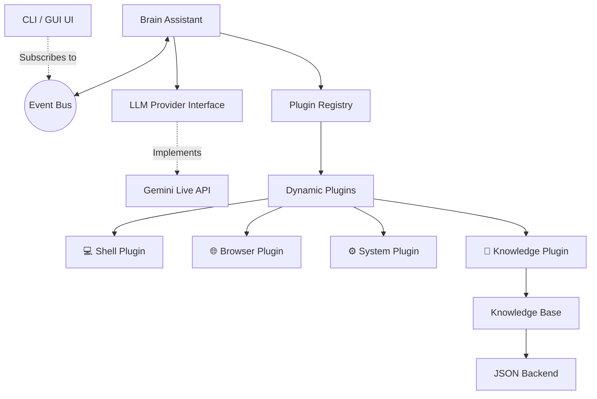

<div align="center">
  
  <h1>Atlas</h1>
  <p><b>AI Runtime for Desktop Assistants</b></p>
  <p>
    <i>Atlas no es solo un asistente de voz. Es un runtime modular impulsado por eventos diseñado para construir agentes multimodales autónomos en tu escritorio.</i>
  </p>
</div>

---

<div align="center">
  <b>🎙 Voice</b> • <b>🧠 Knowledge</b> • <b>🖥 Desktop</b> • <b>👁 Vision</b> • <b>🔌 Plugins</b> • <b>⚡ Event Driven</b>
</div>

---

## 🌟 What is Atlas?

Atlas es un marco de ejecución (runtime) diseñado para cerrar la brecha entre los LLMs y tu sistema operativo. A diferencia de un simple script que consume una API, Atlas proporciona una arquitectura completa basada en eventos, permitiendo que tu asistente escuche, observe, recuerde y ejecute acciones de forma autónoma (o supervisada) en tu entorno de trabajo.

### ¿Qué problema resuelve?
Los asistentes actuales suelen estar limitados al navegador o acoplados fuertemente a un único proveedor de IA. Atlas extrae la lógica central (el "cerebro") y desacopla todas las demás partes:
- **Cambia de proveedor** (Gemini, OpenAI, Claude) con solo tocar la configuración.
- **Añade nuevas habilidades** instantáneamente gracias al sistema dinámico de plugins.
- **Mantén el contexto a largo plazo** con una base de conocimiento nativa, que no depende del historial temporal del LLM.

---

## 🏗 Arquitectura

Atlas está construido bajo principios estrictos de **Clean Architecture**:



- **🧠 Brain**: Coordina el micrófono, la voz, la VAD (Voice Activity Detection) y el bucle de eventos.
- **⚡ Event Bus**: Toda la comunicación es mediante eventos fuertemente tipados (`ToolStarted`, `SpeechRecognized`, `KnowledgeUpdated`). Esto permite escalar a GUIs o sistemas de telemetría sin tocar el núcleo.
- **🔌 Plugins**: Todas las herramientas (Shell, Browser, System, Memoria) se cargan dinámicamente y se aíslan.
- **📚 Knowledge Base**: Un subsistema de memoria persistente con control de versión.

---

## 🚀 Getting Started

### 1. Requisitos
- Python 3.10+
- Bibliotecas del sistema (para PyAudio y dependencias de voz):
  ```bash
  sudo apt-get install portaudio19-dev python3-pyaudio
  ```

### 2. Instalación
```bash
git clone https://github.com/tu-usuario/atlas.git
cd atlas
python3 -m venv venv
source venv/bin/activate
pip install -r requirements.txt
```

### 3. Configuración
Crea un archivo `config.yaml` o edita el existente para configurar tus proveedores. Atlas descubrirá automáticamente los plugins.
```yaml
provider:
  type: gemini
  model: models/gemini-2.0-flash-exp
```

```bash
export GEMINI_API_KEY="tu_clave_aqui"
export TAVILY_API_KEY="tu_clave_aqui" # Para búsqueda web
```

### 4. Ejecución
```bash
python3 jarvis.py
```

---

## 📐 Decisiones de Arquitectura

Atlas está construido pensando en el largo plazo. Aquí explicamos el *porqué* detrás de las decisiones más importantes:

- **¿Por qué un Event Bus?**
  Los asistentes tradicionales acoplan la interfaz (como la terminal o la voz) a la lógica central, llenando el código de `print()` o callbacks. Al usar un Event Bus, el cerebro solo *emite* eventos (`SpeechRecognized`, `ToolStarted`). Cualquier interfaz (como nuestra CLI en `rich` o una futura GUI) solo debe suscribirse a los eventos. Cero acoplamiento.

- **¿Por qué Providers abstractos?**
  Las APIs de OpenAI, Gemini y Claude cambian constantemente. En Atlas, el núcleo solo interactúa con un `BaseProvider`. Si el día de mañana sale un modelo mejor, solo creas un nuevo provider; las herramientas y la lógica de negocio permanecen intactas.

- **¿Por qué un sistema de Plugins?**
  Permite aislar dependencias. El plugin de Visión necesita `mss` y `Pillow`; el de Shell necesita acceso a subprocesos. Si alguien no necesita visión, simplemente borra el plugin y el sistema sigue funcionando. Además, facilita que la comunidad extienda Atlas sin tocar el núcleo.

- **¿Por qué separar la Knowledge Base?**
  Los LLMs tienen memoria a corto plazo limitada por su ventana de contexto. Atlas tiene un subsistema de memoria (`KnowledgeManager`) agnóstico del proveedor. Esto permite a Atlas construir un perfil del usuario y recordar notas a través de meses de uso, persistiendo en JSON (y fácilmente migrable a SQLite).

- **¿Por qué ToolContext y ToolResult?**
  Estandarizar las entradas y salidas de las herramientas garantiza que cualquier plugin devuelva un contrato predecible. El `ToolContext` permite inyectar dependencias globales (como el Event Bus o el Config) hacia las herramientas sin usar variables globales.

---

## 🗺 Roadmap

- [x] **Provider Abstraction**: Soporte para múltiples backends de LLM.
- [x] **Plugin Registry**: Abstracción de herramientas.
- [x] **Knowledge Base**: Subsistema de memoria persistente.
- [x] **Event-Driven UI**: CLI reactiva conectada al bus de eventos.
- [ ] **Vision Plugin**: Análisis de pantalla en tiempo real y OCR.
- [ ] **MCP (Model Context Protocol)**: Soporte nativo para herramientas externas estandarizadas.
- [ ] **Observability**: Exportación de métricas a Prometheus/Grafana.
- [ ] **GUI**: Interfaz gráfica minimalista construida sobre el Event Bus.

---

## 🤝 Contributing

¡Las PRs son bienvenidas! Para añadir un nuevo plugin, simplemente crea una carpeta en `src/plugins/tu_plugin/`, define tus clases heredando de `BaseTool` y exporta la función `setup(registry, dependencies)`. Atlas se encargará del resto.
