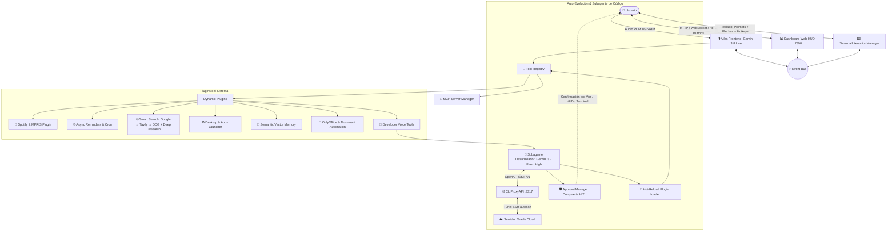

<div align="center">
  <h1>⚡ Atlas AI Runtime</h1>
  <p><b>Auto-Evolving Multi-Agent Voice & Desktop AI Platform</b></p>
  <p>
    <i>Atlas es un runtime modular impulsado por eventos que combina interacción por voz en tiempo real (<250ms), subagentes de desarrollo en segundo plano con razonamiento profundo (Gemini 3.7 Flash), compuerta de aprobación humana (HITL), búsqueda multi-motor inteligente (Google Grounding → Tavily → DuckDuckGo), Deep Research y recarga de herramientas en caliente.</i>
  </p>
</div>

---

<div align="center">
  <b>🎙 Gemini 3.8 Live</b> • <b>🧠 Gemini 3.7 Flash</b> • <b>🛡️ HITL Approval</b> • <b>🔍 Smart Multi-Search & Deep Research</b> • <b>🔄 Hot-Reload</b> • <b>🎵 Spotify MPRIS</b> • <b>🔌 MCP & Plugins</b> • <b>📊 Web HUD (:7890)</b> • <b>⌨️ Terminal Prompts & Shortcuts</b>
</div>

---

## 🌟 Arquitectura General del Sistema

Atlas está construido bajo principios estrictos de **Clean Architecture** y comunicación desacoplada por **EventBus**:



---

## ✨ Características Principales

### 1. 🎙️ Frontend de Voz de Ultra Baja Latencia & Streaming
- **Modelo**: `gemini-3.8-live` vía **Google GenAI Multimodal Live API** (WebSocket bidireccional dúplex).
- **Fallback en caliente de modelo**: si el backend del primario queda saturado (`1011`/`503` en sesiones cortas), Atlas cambia en runtime a `provider.fallback_model` (`gemini-3.1-flash-live-preview` por defecto) **sin tocar `config.yaml`**; sondea al primario cada `fallback_probe_interval` y vuelve solo en cuanto se recupera. Un aviso aparece en HUD/consola al activarse y al volver.
- **Voz nativa**: Síntesis y reconocimiento End-to-End sin pipelines STT/TTS lentos.
- **Transcripción y Visualización en Terminal**: Emisión de texto en tiempo real (`output_audio_transcription`) con prefijo `│ 🤖 Atlas: ` en la consola mientras el audio suena por los parlantes.
- **Detección VAD Multi-Feature**: Filtra ruidos mecánicos y respiración mediante análisis adaptativo de energía RMS, ZCR (Zero-Crossing Rate) y Crest Factor.
- **VAD del servidor en Gemini 3.8 Live**: este modelo ignora `audio_stream_end`, por lo que Atlas fuerza automáticamente el cierre de turno por pausa natural (~1s) con detección de actividad del lado del servidor.
- **Silenciamiento ALSA/PortAudio**: Supresión de errores de bajo nivel en Linux mediante bindings `ctypes`.
- **Reconexión Resiliente y Transparente**: Recuperación en 0.5s ante desconexiones de inactividad (código 1008), sin repetir el banner de bienvenida ni interrumpir con audios iniciales, preservando el buffer de teclado de la terminal.

### 2. ⌨️ Interacción por Terminal Avanzada (`TerminalInteractionManager`)
- **Escritura Libre de Prompts**: Escribe párrafos de texto con auto-wrap nativo sin duplicación.
- **Edición en Línea y Navegación**: Flechas (`←` / `→`), `Inicio` (Home), `Fin` (End), `Supr` (Delete), `Backspace`.
- **Historial de Prompts**: Flechas (`↑` / `↓`) para navegar comandos y prompts anteriores.
- **Atajos Directos de Mute**:
  - `Tab`: 1 sola tecla para silenciar/reanudar micrófono al instante.
  - `Shift + Espacio`: Protocolo extendido `modifyOtherKeys`.
  - `Ctrl + Espacio`: Compatibilidad universal Linux VT100/ANSI.
  - `F2`: Tecla de función superior.
- **Pausa sin mute del sistema**: al pausar, Atlas cierra el stream de captura (el `source-output` de PulseAudio desaparece al instante y el icono de micrófono de GNOME se apaga) y lo reabre al reanudar (~6ms). No se mutea la fuente del sistema: otras apps conservan el micrófono y un cierre inesperado de Atlas no deja estado pegajoso. Si la pausa supera `pause_suspend_after` (90s por defecto), además **suspende la sesión Live** (cierra el WebSocket, evitando reconnects idle cada ~50 min) y la reconecta automáticamente al reanudar.
- **Ajuste de Sensibilidad VAD**: `Ctrl + Arriba` / `Ctrl + Abajo` (+500 / -500).
- **Aprobación de 1 Tecla**: Presiona `[Enter]` en una línea vacía para aprobar solicitudes HITL pendientes, o escribe `n`/`no` para rechazar.
- **Comandos Slash Rápidos**: `/mute`, `/help`, `/clear`.

### 3. 🔍 Búsqueda Multi-Motor Inteligente & Deep Research
- **Jerarquía con Fallback Automático**:
  1. **Google Search Grounding** (Motor Primario, 2.5s timeout).
  2. **Fallbacks en paralelo** (compiten, gana el primero útil por prioridad): **Tavily API** → **Exa** → **DuckDuckGo** (vía `ddgs`, meta-buscador gratuito sin API key: DuckDuckGo, Bing, Brave, Mojeek...).
- **Trazabilidad Visual**: Insignias dinámicas en consola (`[GOOGLE ✅]`, `[GOOGLE ❌ → TAVILY ✅ → EXA ✓]`, etc.).
- **Lector de Páginas Web**: Extracción limpia de artículos y contenido web.
- **Motor Deep Research (4 Fases)**:
  1. *Planificación*: Gemini 3.7 genera 3 subconsultas complementarias.
  2. *Búsqueda Concurrente*: Consulta multi-fuente en paralelo.
  3. *Lectura Profunda*: Descarga y analiza las páginas más relevantes.
  4. *Síntesis con Razonamiento*: Gemini 3.7 Flash redacta reporte estructurado y resumen para voz.

### 4. 🧠 Subagente de Desarrollo Auto-Evolutivo (Gemini 3.7 Flash)
- **Modelo**: `gemini-3.8-flash-high` con **Thinking/Reasoning tokens**.
- **Conexión**: Consume `CLIProxyAPI` en `http://127.0.0.1:8317/v1` mediante túnel persistente `autossh` a Oracle Cloud.
- **Capacidades**: Puede explorar el proyecto, escribir nuevos plugins en `src/plugins/`, correr la suite de `pytest` y recargar las herramientas en caliente sin reiniciar Atlas.

### 5. 🛡️ Compuerta de Aprobación Humana (HITL - Human-In-The-Loop)
- Ninguna acción crítica (creación de archivos, comandos bash) se ejecuta sin tu autorización.
- **Sincronización multi-canal**:
  - **Voz**: Atlas pregunta *"El agente solicita permiso para crear X. ¿Lo apruebas?"* y reconoce *"Apruebo"*, *"Confirmar"*, *"Rechaza el cambio"*.
  - **Web HUD**: Banner interactivo con vista previa del código y botones `[✅ Aprobar]` / `[❌ Rechazar]`.
  - **Terminal**: Aprobación directa con `[Enter]` en línea vacía.
- **Confirmación dura para comandos destructivos**: `shutdown`, `reboot`, `rm -rf`, `mkfs`, `dd`… no se ejecutan solo porque el modelo crea que aceptaste: el tool valida la última frase real del usuario (voz transcrita o texto) y exige una confirmación explícita y reciente (*"confirmo"*, *"apruebo"*, *"ejecuta"*). Una frase ambigua o un "sí" a otra pregunta no alcanza.

### 6. 🔄 Recarga en Caliente (*Hot-Reloading*)
- Las nuevas herramientas creadas por el subagente se inyectan en el `ToolRegistry` activo en memoria instantáneamente sin reiniciar el proceso.

### 7. 🎵 Control Multimedia y Spotify Nativo (MPRIS D-Bus)
- Reproducción directa con búsqueda inteligente (`reproducir_musica(busqueda="Queen")`).
- Control de reproducción: Play, Pausa, Siguiente, Anterior y consulta de qué canción está sonando (`que_suena`).

### 8. ⏰ Motor de Recordatorios Asíncrono
- Recordatorios en lenguaje natural persistentes en JSON (`crear_recordatorio`, `listar_recordatorios`, `cancelar_recordatorio`).
- Notificaciones de escritorio nativas en Ubuntu vía `notify-send` y alertas de sonido vía PipeWire.

### 9. 🔌 Soporte para Servidores MCP (Model Context Protocol)
- Conexión dinámica a servidores MCP externos (filesystem, SQLite, GitHub, etc.) sobre `stdio` mediante JSON-RPC 2.0.

### 10. 📊 Dashboard Web HUD en Tiempo Real (`http://localhost:7890`)
- Visualizador de ondas de audio, chat bidireccional texto/voz, botón de mute/pausa, visualizador de recordatorios y modal HITL de aprobaciones.
- **Modelo activo en vivo**: badge en el header (`/api/status`) que muestra el modelo en uso y se pone ámbar cuando el respaldo está activo; los cambios de proveedor también aparecen como notificación en el chat y en la consola.

---

## 🛠️ Estructura del Código

```text
├── jarvis.py                   # Punto de entrada y orquestador del runtime
├── config.yaml                 # Configuración centralizada de modelos, UI y MCP
├── requirements.txt            # Dependencias del proyecto
├── src/
│   ├── brain/                  # Orquestador del asistente y bucle de audio
│   ├── providers/              # Abstracción agnóstica de proveedores (Gemini Live)
│   ├── agents/                 # Subagente desarrollador ReAct y cliente CLIProxyAPI
│   ├── security/               # Compuerta HITL (ApprovalManager)
│   ├── events/                 # EventBus y catálogo de eventos de dominio
│   ├── tools/                  # Contrato BaseTool y ToolRegistry con Hot-Reload
│   ├── plugins/                # Plugins modulares
│   │   ├── browser/            # Smart Search multi-motor, Reader y Deep Research
│   │   ├── developer/          # Herramientas de voz para delegar tareas y aprobar
│   │   ├── email/              # Envío de correo Gmail PWA con URL de composición
│   │   ├── media/              # Control nativo de Spotify vía D-Bus MPRIS
│   │   ├── office/             # Automatización de documentos OnlyOffice
│   │   ├── reminders/          # Herramientas de recordatorios y alarmas
│   │   ├── system/             # Control de aplicaciones de escritorio y sistema
│   │   ├── knowledge/          # Memoria persistente y notas
│   │   ├── vision/             # Captura y análisis de pantalla
│   │   └── whatsapp/           # Mensajería WhatsApp Web PWA reactiva con AT-SPI2
│   ├── knowledge/              # Base de conocimiento y búsqueda semántica vectorial
│   ├── reminders/              # Planificador asíncrono y notificaciones SO
│   ├── mcp/                    # Cliente y gestor de servidores Model Context Protocol
│   ├── ui/                     # CLI interactiva, TerminalInput y servidor Web HUD
│   ├── utils/                  # Logging estructurado, rotativo y sensor AT-SPI2
│   └── voice/                  # Captura de audio, VAD inteligente y reproductor PipeWire
├── tests/                      # Suite de 442 pruebas automatizadas con pytest (100% passing)
└── debug/                      # Scripts auxiliares de diagnóstico y testing
```

---

## 🚀 Puesta en Marcha

### 1. Variables de Entorno
```bash
export GEMINI_API_KEY="tu_clave_de_gemini_aistudio"
export TAVILY_API_KEY="tu_clave_de_tavily"  # Opcional (DuckDuckGo funciona como fallback gratuito)
```

### 2. Iniciar el Túnel hacia CLIProxyAPI (Oracle Server)
```bash
# Iniciar el servicio persistente de autossh (puerto local 8317)
systemctl --user start cliproxy-tunnel
```

### 3. Ejecutar la Suite de Pruebas
```bash
./venv/bin/pytest tests/ -v
```

### 4. Iniciar Atlas
```bash
./venv/bin/python3 jarvis.py
```

---

## 🎙️ Ejemplos de Comandos y Atajos

| Lo que haces / dices | Acción ejecutada por Atlas |
| :--- | :--- |
| **Presionar `Tab` o `Shift+Espacio`** | Silencia / Reanuda el micrófono al instante con feedback auditivo. |
| **Escribir prompt + `[Enter]`** | Envía una instrucción de texto directamente a Atlas desde la terminal. |
| **Presionar `[Enter]` en autorización** | Aprueba inmediatamente una solicitud HITL pendiente del subagente. |
| *"Hey Atlas, pon música de Coldplay en Spotify"* | Busca y reproduce inmediatamente en Spotify vía D-Bus. |
| *"¿Qué canción está sonando?"* | Consulta la metadata de Spotify y te dice título, artista y álbum. |
| *"Investiga en profundidad sobre la arquitectura MoE"* | Ejecuta Deep Research (4 pasos) con síntesis estructurada. |
| *"Recuérdame revisar el correo en 15 minutos"* | Agenda un recordatorio con alerta de sonido y `notify-send`. |
| *"Crea un plugin para consultar el clima en Santiago"* | Delega a **Gemini 3.7 Flash** en segundo plano, solicita aprobación HITL, corre pruebas y lo recarga en caliente sin reiniciar. |
